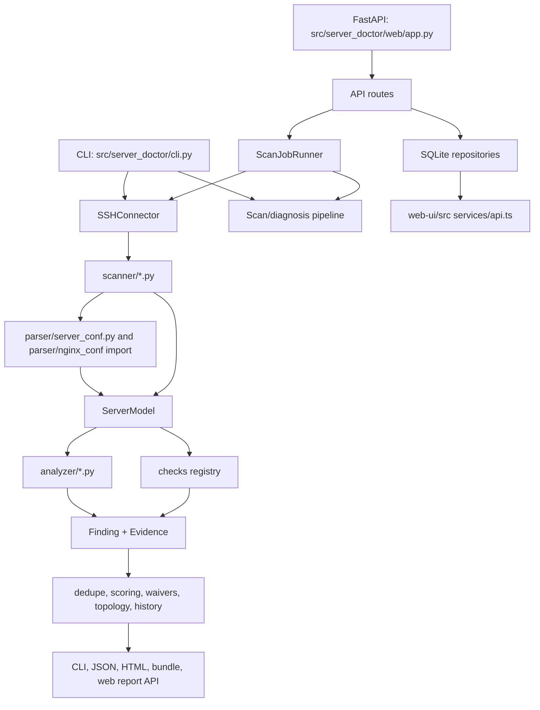

# PROJECT_CONTEXT.md
# ServerDoctor
Last updated: 2026-05-09

## 1. PROJECT IDENTITY

### Name

The project is called **ServerDoctor** in the current codebase.

The historical docs also use **server-doctor**, **nginx-doctor**, and **Nginx Doctor**. Treat **ServerDoctor** / `server-doctor` as the current product identity because `pyproject.toml`, `src/server_doctor/`, `README.md`, and the React UI all use that name.

### One-sentence description

ServerDoctor is a local, SSH-based infrastructure diagnosis system that scans Linux servers, models Nginx/PHP/application/runtime state, detects operational and security findings, and produces CLI, JSON, web UI, and HTML report outputs.

### Problem solved

ServerDoctor helps developers, operators, and system administrators answer: "Why is this Nginx/PHP/app server unsafe, misconfigured, slow, exposed, or likely to break?"

It solves this by connecting over SSH, collecting read-only evidence, building a structured `ServerModel`, running analyzers and modular checks, deduplicating and scoring findings, and rendering reports with evidence, remediation, topology, and support-pack data.

### Users

Primary users:

| User | What they do with ServerDoctor |
| --- | --- |
| Developers deploying PHP/Laravel/Node apps | Check Nginx roots, PHP-FPM sockets, app routing, missing security headers, and exposed files. |
| Freelance/server operators | Run local scans against customer VPS instances without installing an agent. |
| DevOps engineers | Produce scan reports, CI/CD output, SARIF/GitHub annotations, and recurring monitoring jobs. |
| Support engineers | Use generated HTML reports, support packs, topology views, and reproduction commands to triage issues. |

### Differentiators

ServerDoctor differs from a normal config linter because it correlates multiple evidence sources:

| Differentiator | Code location |
| --- | --- |
| Uses SSH instead of an installed server agent | `src/server_doctor/connector/ssh.py` |
| Separates collection from reasoning | `src/server_doctor/pipeline.py`, `src/server_doctor/scanner/`, `src/server_doctor/analyzer/`, `src/server_doctor/checks/` |
| Builds a typed server-wide model before diagnosis | `src/server_doctor/model/server.py` |
| Requires every `Finding` to carry evidence | `src/server_doctor/model/finding.py`, `src/server_doctor/model/evidence.py` |
| Handles Nginx, PHP-FPM, Docker, Node, MySQL, Redis, systemd, TLS, Certbot, firewall, logs, storage, resources, kernel limits, supply chain, Kubernetes, and CI posture | `src/server_doctor/scanner/`, `src/server_doctor/analyzer/`, `src/server_doctor/checks/` |
| Includes both a CLI and a local FastAPI/React operator console | `src/server_doctor/cli.py`, `src/server_doctor/web/app.py`, `web-ui/src/` |
| Stores web scan history in SQLite with job logs and findings | `src/server_doctor/storage/models.py`, `src/server_doctor/storage/repositories.py` |
| Generates standalone HTML reports plus bundle artifacts | `src/server_doctor/actions/html_report.py`, `src/server_doctor/actions/report_bundle.py` |

## 2. ARCHITECTURE OVERVIEW

### Major components

| Component | Responsibility | Key files |
| --- | --- | --- |
| CLI | Click command group, profile resolution, scan/diagnose/discover/recommend/generate/apply/web/ci/daemon/notify commands | `src/server_doctor/cli.py`, `src/server_doctor/__main__.py` |
| Config manager | Stores SSH profiles and notification config under `~/.server-doctor/profiles.yaml` or `server_doctor_CONFIG`; stores passwords in keyring when possible | `src/server_doctor/config.py` |
| SSH connector | Paramiko connection lifecycle, command execution, sudo wrapping, bounded parallel exec, file/directory helpers, explicit write helper | `src/server_doctor/connector/ssh.py` |
| Scan pipeline | Shared orchestration used by web jobs; collects raw server facts, creates `ServerModel`, runs diagnosis, waivers, scoring, topology, history | `src/server_doctor/pipeline.py` |
| Scanners | Read-only SSH collection modules. They run commands and produce raw/structured facts. | `src/server_doctor/scanner/*.py` |
| Parser | Converts text config into typed Nginx/server config structures with line numbers | `src/server_doctor/parser/server_conf.py`; current code also imports `server_doctor.parser.nginx_conf`, but that file is not present in the checked file list. |
| Model | Dataclasses and enums representing the server, services, runtime, topology, projects, findings, and evidence | `src/server_doctor/model/server.py`, `src/server_doctor/model/finding.py`, `src/server_doctor/model/evidence.py` |
| Legacy analyzers | Model-only reasoning classes that emit findings for many domains | `src/server_doctor/analyzer/*.py` |
| Modular check system | Registry/decorator-based checks with feature flags and optional SSH access | `src/server_doctor/checks/__init__.py`, `src/server_doctor/checks/*/*_auditor.py` |
| Engines | Deduplication, scoring, topology, history, waivers, recommendations, knowledge base | `src/server_doctor/engine/*.py` |
| Actions | CLI/report output, HTML reports, CI formatters, generation, apply, safe-fix, fix packs | `src/server_doctor/actions/*.py` |
| AI diagnosis | Converts findings, score, topology, and history into a higher-level diagnosis object | `src/server_doctor/ai/diagnoser.py` |
| Storage | SQLite schema, per-thread connections, repositories for servers, scan jobs, findings, logs, correlations, fix attempts, and accepted risks | `src/server_doctor/storage/*.py` |
| FastAPI app | Localhost operator console API, SPA serving, startup/shutdown hooks | `src/server_doctor/web/app.py`, `src/server_doctor/web/routes/*.py` |
| Web scan runner | Background `ThreadPoolExecutor` scan execution with DB status/log updates | `src/server_doctor/web/job_runner.py` |
| Web setup wizard | Session-based SSH connect, config preview, typed-confirmation apply, safe remote edits | `src/server_doctor/web/routes/connect.py`, `src/server_doctor/web/routes/preview.py`, `src/server_doctor/web/routes/apply.py`, `src/server_doctor/web/safe_apply.py`, `src/server_doctor/web/snippets.py` |
| Fix validation, lifecycle, and baseline | Generates targeted validation probes for stored findings, stores expected/observed validation attempts, fingerprints findings across scans, records lifecycle events, marks reappeared validated findings as regressions, and lets users accept intentional risks for readiness filtering | `src/server_doctor/engine/fix_validation.py`, `src/server_doctor/engine/finding_fingerprint.py`, `src/server_doctor/engine/regression.py`, `src/server_doctor/web/routes/fixes.py`, `src/server_doctor/web/routes/baseline.py`, `src/server_doctor/web/routes/readiness.py` |
| React UI | Vite/React SPA for dashboard, servers, jobs, reports, daemon, integrations, Kubernetes | `web-ui/src/` |

### Component connections



### Runtime flow: CLI diagnosis

1. User runs `server-doctor diagnose <server>` or `python -m server_doctor diagnose <server>`.
2. `src/server_doctor/cli.py` resolves `<server>` through `ConfigManager.get_profile()` or treats it as `root@host`.
3. `SSHConnector` connects using key, password, ssh-agent, or default keys.
4. `cli.py:_scan_server()` currently performs a scan path similar to `pipeline.py:run_full_scan()`.
5. Scanner modules collect OS, Nginx, PHP, Docker, MySQL, Node, firewall, telemetry, security baseline, vulnerabilities, systemd, Redis, workers, Certbot, TLS, network surface, and upstream probes.
6. Nginx config is parsed into `NginxInfo`, `ServerBlock`, `LocationBlock`, and `UpstreamBlock`.
7. App roots are discovered from Nginx roots, Docker bind mounts, and Node process working directories.
8. `AppDetector` classifies project types and produces `ProjectInfo`.
9. `CorrelationEngine(model).correlate_all()` attaches correlation evidence.
10. Legacy analyzers and modular checks produce `Finding` objects with `Evidence`.
11. `deduplicate_findings()` removes duplicate/overlapping findings.
12. `engine.waivers` suppresses accepted risks.
13. `engine.topology` builds a topology snapshot.
14. `engine.history` optionally computes trend and appends scan history.
15. `HTMLReportAction` and `ReportBundleAction` write `report.html`, `summary.txt`, `model.json`, `findings.json`, `trend.json`, `topology.json`, and optional waived/certbot artifacts.

### Runtime flow: web scan

1. User starts the local web app with `server-doctor web --port 8765`.
2. `src/server_doctor/web/app.py:create_app()` creates a FastAPI app, mounts `/static`, registers routers under `/api`, and initializes SQLite plus `ScanJobRunner` on startup.
3. React UI calls `/api/servers` and `/api/scan` through `web-ui/src/services/api.ts`.
4. `POST /api/scan` creates a `scan_jobs` row and submits a background scan to `ScanJobRunner`.
5. `ScanJobRunner._run_scan()` connects over SSH, calls `pipeline.run_full_scan()`, calls `pipeline.run_full_diagnosis()`, generates an HTML report under `data/reports/<job_id>/report.html`, stores findings, stores correlations, stores model JSON, and updates progress.
6. UI polls `/api/scan/jobs/{job_id}` for status/logs and opens `/api/reports/{job_id}` for report data.

### Runtime flow: setup wizard preview/apply

1. `POST /api/connect` creates an in-memory SSH session and returns `host_id`.
2. `GET /api/domains?host_id=...` uses the session and Nginx scanner to list domains.
3. `POST /api/preview-setup` validates project type/path/root/proxy settings, finds the matching Nginx server block, detects FPM socket, generates snippets, and warns about overlap, duplicate markers, missing sockets, or Nginx-to-Apache proxy mode.
4. `POST /api/apply-setup` requires typed confirmation `{ typed: "APPLY", ack: true }`, reruns preview, rejects duplicate markers, creates an in-memory apply job, and calls `run_safe_apply()` under a per-host lock.
5. Safe apply is expected to backup, insert snippets, run validation, reload only after success, and rollback on failure. See `src/server_doctor/web/safe_apply.py`.

### Data flow

| Phase | Input | Output | Files |
| --- | --- | --- | --- |
| Connection | `SSHConfig` | Active `SSHConnector` | `src/server_doctor/connector/ssh.py` |
| Collection | Remote shell commands | scanner result dataclasses and raw text | `src/server_doctor/scanner/*.py` |
| Parsing | `nginx -T` text and config files | `NginxInfo`, `ServerBlock`, `LocationBlock`, `UpstreamBlock` | `src/server_doctor/parser/server_conf.py`; `pipeline.py` imports `server_doctor.parser.nginx_conf` |
| Modeling | Scanner outputs | `ServerModel` | `src/server_doctor/model/server.py`, `src/server_doctor/pipeline.py` |
| Analysis | `ServerModel` and optional SSH | `list[Finding]` | `src/server_doctor/analyzer/*.py`, `src/server_doctor/checks/` |
| Normalization | Raw findings | deduplicated, waived, scored findings | `src/server_doctor/engine/deduplication.py`, `src/server_doctor/engine/waivers.py`, `src/server_doctor/engine/scoring.py` |
| Persistence | server records, jobs, findings, logs, correlations, fix attempts, accepted risks, finding lifecycle events | SQLite rows | `src/server_doctor/storage/models.py`, `src/server_doctor/storage/repositories.py` |
| Output | model/findings/diagnosis | terminal output, JSON, SARIF, HTML, report bundle, web JSON | `src/server_doctor/actions/`, `src/server_doctor/web/routes/reports.py` |

## 3. TECH STACK

### Languages

| Language | Where used |
| --- | --- |
| Python 3.10+ | Backend package under `src/server_doctor/`, CLI, scanners, analyzers, FastAPI, storage, report generation, tests |
| TypeScript | React UI under `web-ui/src/` |
| TSX/React | UI pages and components under `web-ui/src/pages/` and `web-ui/src/components/` |
| CSS | `web-ui/src/index.css`, `web-ui/src/App.css`, Tailwind utility styling |
| HTML/Jinja2 | Backend HTML report template `src/server_doctor/templates/report.html`; Vite `web-ui/index.html` |
| PowerShell | Windows dev stack runner `dev.ps1` |
| Batch | `dev.cmd` wrapper |
| Shell | Fix pack script `fix-pack/hardening.sh` |
| Dockerfile | Multi-stage UI/backend image in `Dockerfile` |

### Python frameworks/libraries

| Dependency | Why it exists | Declared in |
| --- | --- | --- |
| `paramiko>=3.4.0` | SSH connection and command execution | `pyproject.toml` |
| `click>=8.1.0` | CLI command framework | `pyproject.toml`, `src/server_doctor/cli.py` |
| `rich>=13.7.0` | Rich terminal reporting and panels | `pyproject.toml`, `src/server_doctor/actions/report.py`, `src/server_doctor/cli.py` |
| `PyYAML>=6.0.0` | Profile and waiver YAML handling | `pyproject.toml`, `src/server_doctor/config.py`, `src/server_doctor/engine/waivers.py` |
| `jinja2>=3.1.0` | HTML report rendering | `pyproject.toml`, `src/server_doctor/actions/html_report.py` |
| `keyring>=24.0.0` | Secure password storage for CLI profiles when available | `pyproject.toml`, `src/server_doctor/config.py` |
| `fastapi>=0.110.0` | Local API and operator console backend | `pyproject.toml`, `src/server_doctor/web/app.py` |
| `uvicorn>=0.28.0` | ASGI server for local web app | `pyproject.toml`, `src/server_doctor/web/app.py` |
| `requests>=2.31.0` | HTTP client use by scanner/integration code | `pyproject.toml` |
| `pytest`, `pytest-cov`, `pytest-mock`, `httpx`, `ruff`, `mypy` | Development, tests, lint, type checking | `pyproject.toml` optional `dev` extras |

### Frontend frameworks/libraries

| Dependency | Why it exists | File |
| --- | --- | --- |
| React 19 | SPA rendering | `web-ui/package.json`, `web-ui/src/App.tsx` |
| React DOM 19 | Browser mounting | `web-ui/package.json`, `web-ui/src/main.tsx` |
| React Router DOM 6 | Client routes | `web-ui/package.json`, `web-ui/src/router.tsx` |
| Vite 7 | Dev server and production build | `web-ui/package.json`, `web-ui/vite.config.ts` |
| TypeScript 5.9 | Type checked frontend | `web-ui/package.json`, `web-ui/tsconfig*.json` |
| Tailwind CSS 3 | Utility styling | `web-ui/package.json`, `web-ui/tailwind.config.js` |
| ESLint 9 | Frontend linting | `web-ui/eslint.config.js`, `web-ui/package.json` |

### Build/dev pipeline

| Task | Command | Files |
| --- | --- | --- |
| Install backend editable | `pip install -e .` | `pyproject.toml` |
| Install backend with dev deps | `pip install -e .[dev]` | `pyproject.toml` |
| Run Python tests | `python -m pytest` | `pytest.ini`, `pyproject.toml`, `tests/` |
| Build frontend | `cd web-ui && npm ci && npm run build` | `web-ui/package.json` |
| Run frontend dev server | `cd web-ui && npm run dev` | `web-ui/package.json` |
| Run backend web server | `server-doctor web --port 8765` or `python -m server_doctor web --port 8765` | `src/server_doctor/cli.py`, `src/server_doctor/web/app.py` |
| Run full Windows dev stack | `.\dev.ps1` | `dev.ps1` |
| Docker build | `docker build -t server-doctor .` | `Dockerfile` |
| Docker run | `docker run --rm -p 8765:8765 server-doctor` | `Dockerfile` |

### Storage technology

ServerDoctor uses SQLite for local web-console persistence.

| Aspect | Detail | File |
| --- | --- | --- |
| DB file | Default `./data/server_doctor.db` relative to current working directory | `src/server_doctor/storage/db.py` |
| Connection model | `threading.local()` per-thread SQLite connections | `src/server_doctor/storage/db.py` |
| SQLite settings | `PRAGMA journal_mode=WAL`, `PRAGMA foreign_keys=ON`, `sqlite3.Row` row factory | `src/server_doctor/storage/db.py` |
| Schema creation | `init_db()` runs `CREATE TABLE IF NOT EXISTS` DDL and migrations | `src/server_doctor/storage/db.py`, `src/server_doctor/storage/models.py` |
| Migrations | Adds `scan_jobs.model_json` and `scan_jobs.repo_scan_paths` if missing | `src/server_doctor/storage/db.py` |
| Why SQLite | Local-only operator console, no server-side deployment dependency, simple persistent job history | inferred from code structure in `src/server_doctor/storage/` and local binding in `src/server_doctor/web/app.py` |

## 4. REPOSITORY MAP

### Top-level structure

| Path | Purpose |
| --- | --- |
| `.github/` | GitHub metadata/workflows/templates if present. Not inspected deeply in this document. |
| `.vscode/` | Editor settings. |
| `data/` | Runtime SQLite database and generated web reports. Contains `data/server_doctor.db` and `data/reports/<job_id>/report.html`. |
| `docs/` | Hand-written architecture notes. `docs/architecture.md` is useful but older than current code in some areas. |
| `fix-pack/` | Example/generated remediation pack files such as `hardening.sh` and `server_patch.conf`. |
| `reports/` | CLI-generated report bundles organized by host/date or timestamp. |
| `src/server_doctor/` | Python backend package. This is the most important code root. |
| `tests/` | Pytest test suite for analyzers, scanners, routes, storage, safe fix, reports, topology, and job runner. |
| `web-ui/` | Vite React TypeScript frontend. |
| `README.md` | Current user-facing overview and quick start. Contains mojibake characters but useful content. |
| `Project.md` | Older project spec that still says `nginx-doctor`; treat as historical intent, not source of truth. |
| `pyproject.toml` | Python package metadata, dependencies, console script, ruff/mypy/pytest config. |
| `pytest.ini` | Minimal pytest config. |
| `Dockerfile` | Multi-stage build for frontend then Python runtime. |
| `dev.ps1` | Windows script to start backend and frontend dev servers with scan-related env defaults. |
| `dev.cmd` | Windows command wrapper. |
| `.env.example` | Environment variable examples. |
| `.env` | Local secrets/config; do not commit or quote contents. |

### Backend package map

| Path | Purpose |
| --- | --- |
| `src/server_doctor/__main__.py` | Enables `python -m server_doctor`. |
| `src/server_doctor/__init__.py` | Package metadata such as `__version__`. |
| `src/server_doctor/cli.py` | Main Click CLI and older inline scan orchestration. |
| `src/server_doctor/pipeline.py` | Shared scan and diagnosis pipeline used by web job runner. Prefer this for new orchestration work. |
| `src/server_doctor/config.py` | YAML profile and notification config manager. |
| `src/server_doctor/connector/ssh.py` | SSH abstraction and command execution. |
| `src/server_doctor/scanner/` | Data collection modules that run remote commands. |
| `src/server_doctor/parser/` | Config parsing helpers. Current pipeline imports `server_doctor.parser.nginx_conf`, but only `server_conf.py` is visible in this workspace snapshot. |
| `src/server_doctor/model/` | Core dataclasses and enums. |
| `src/server_doctor/analyzer/` | Legacy analyzer/auditor classes that reason about `ServerModel`. |
| `src/server_doctor/checks/` | Modular check registry and category checks. |
| `src/server_doctor/engine/` | Deduplication, waivers, topology, scoring, history, recommendation, remediation, knowledge base. |
| `src/server_doctor/actions/` | Reporting/output/generate/apply/safe-fix/fix-pack/CI formatter actions. |
| `src/server_doctor/ai/` | Diagnosis synthesis objects and generator. |
| `src/server_doctor/storage/` | SQLite schema and repositories. |
| `src/server_doctor/web/` | FastAPI app, route modules, sessions, job runner, safe apply, snippets, static assets. |
| `src/server_doctor/templates/report.html` | Jinja2 template used by `HTMLReportAction`. |
| `src/server_doctor/daemon/` | Monitoring daemon implementation. |
| `src/server_doctor/integrations/` | Notification integration manager. |
| `src/server_doctor/utils/` | Utility code such as environment detection. |

### Frontend map

| Path | Purpose |
| --- | --- |
| `web-ui/src/main.tsx` | React entry point. |
| `web-ui/src/App.tsx` | Renders `RouterProvider`. |
| `web-ui/src/router.tsx` | Defines SPA routes for dashboard, servers, jobs, reports, daemon, integrations, Kubernetes, wizard placeholder. |
| `web-ui/src/services/api.ts` | Typed API client for `/api` endpoints. |
| `web-ui/src/components/AppLayout.tsx` | Main shell/sidebar/header layout. |
| `web-ui/src/components/PageHeader.tsx` | Page header component. |
| `web-ui/src/components/ui/styles.ts` | Reusable class helpers. |
| `web-ui/src/pages/DashboardPage.tsx` | Overview, quick scan, daemon status. |
| `web-ui/src/pages/ServersPage.tsx` | Server management UI. |
| `web-ui/src/pages/JobsPage.tsx` | Job list UI. |
| `web-ui/src/pages/ReportPage.tsx` | Report UI, composed from `web-ui/src/pages/report/components/`. |
| `web-ui/src/pages/report/` | Report utilities, diagnosis handling, and report section components. |

### Key files to read first

1. `src/server_doctor/pipeline.py`: best current mental model of scan and diagnosis flow.
2. `src/server_doctor/model/server.py`: all server/application/runtime dataclasses.
3. `src/server_doctor/model/finding.py` and `src/server_doctor/model/evidence.py`: finding contract.
4. `src/server_doctor/web/job_runner.py`: how the web app runs and persists scans.
5. `src/server_doctor/storage/models.py`: SQLite schema.
6. `src/server_doctor/web/routes/reports.py`: report API shape consumed by React.
7. `web-ui/src/services/api.ts`: frontend's expected API contracts.

### Entry points

| Entry point | File |
| --- | --- |
| Console script `server-doctor` | `pyproject.toml` maps to `server_doctor.cli:main` |
| Python module execution | `src/server_doctor/__main__.py` |
| CLI command group | `src/server_doctor/cli.py:main` |
| FastAPI app factory | `src/server_doctor/web/app.py:create_app` |
| Global ASGI app | `src/server_doctor/web/app.py:app` |
| Uvicorn runner | `src/server_doctor/web/app.py:run_server` |
| React app | `web-ui/src/main.tsx`, `web-ui/src/App.tsx` |

### Configuration locations

| Config | Location |
| --- | --- |
| Python dependencies and package metadata | `pyproject.toml` |
| Pytest options | `pyproject.toml`, `pytest.ini` |
| Ruff and mypy settings | `pyproject.toml` |
| CLI server profiles | `~/.server-doctor/profiles.yaml` by default, or directory from `server_doctor_CONFIG` |
| Web SQLite DB | `./data/server_doctor.db` by default |
| Frontend package/build config | `web-ui/package.json`, `web-ui/vite.config.ts`, `web-ui/tsconfig*.json` |
| Tailwind/PostCSS | `web-ui/tailwind.config.js`, `web-ui/postcss.config.js` |
| Docker runtime | `Dockerfile` |
| Dev environment defaults | `dev.ps1`, `.env.example` |

## 5. CORE FEATURES

### SSH server scanning

ServerDoctor connects to a remote Linux server through Paramiko and runs read-only commands by default.

Implementation:

| Capability | File |
| --- | --- |
| SSH config fields: host, user, port, key path, passphrase, password, sudo, timeout, parallelism | `src/server_doctor/connector/ssh.py` |
| Command execution with sudo wrapping and password stdin | `src/server_doctor/connector/ssh.py` |
| Read helpers: `read_file`, `file_exists`, `dir_exists`, `list_dir` | `src/server_doctor/connector/ssh.py` |
| Profile lookup/fallback host behavior | `src/server_doctor/cli.py`, `src/server_doctor/config.py` |

Inputs: server profile name or hostname/IP, SSH credentials.

Outputs: command results and scanner inputs.

### Unified server model

All scans converge into `ServerModel`.

Implementation:

| Model area | File |
| --- | --- |
| OS, Nginx, PHP, project, Docker, Node, services, runtime, telemetry, logs, storage, resources, kernel limits, security baseline, ops posture, vulnerability, Certbot, TLS, network, probes, supply chain | `src/server_doctor/model/server.py` |
| Finding and evidence | `src/server_doctor/model/finding.py`, `src/server_doctor/model/evidence.py` |

Inputs: scanner results, parsed Nginx config, app detection results.

Outputs: `ServerModel` passed to analyzers/checks/reporters.

### Nginx and application diagnosis

ServerDoctor diagnoses Nginx server blocks, roots, locations, PHP-FPM sockets, Laravel routing, duplicate names, WebSocket proxy behavior, route conflicts, and security headers.

Implementation:

| Feature | Files |
| --- | --- |
| Legacy Nginx/server diagnosis | `src/server_doctor/analyzer/server_doctor.py`, `src/server_doctor/analyzer/server_auditor.py` |
| Application detection | `src/server_doctor/analyzer/app_detector.py` |
| Laravel modular checks | `src/server_doctor/checks/laravel/laravel_auditor.py` |
| PHP-FPM modular checks | `src/server_doctor/checks/phpfpm/phpfpm_auditor.py` |
| Security modular checks | `src/server_doctor/checks/security/security_auditor.py` |
| Performance modular checks | `src/server_doctor/checks/performance/performance_auditor.py` |
| WebSocket checks | `src/server_doctor/analyzer/wss_auditor.py` |
| Route/path conflict checks | `src/server_doctor/analyzer/path_conflict_auditor.py` |

Inputs: Nginx config model, project metadata, PHP info, optional SSH facts.

Outputs: evidence-based findings such as `LARAVEL-*`, `PHPFPM-*`, `NGX-WSS-*`, `NGX-SEC-*`, `ROUTE-*`.

### Runtime and operations posture

ServerDoctor scans and audits runtime services and host posture.

Implementation:

| Domain | Scanners | Auditors/checks |
| --- | --- | --- |
| Docker | `src/server_doctor/scanner/docker.py` | `src/server_doctor/analyzer/docker_auditor.py`, ops Docker rules in `src/server_doctor/analyzer/ops_posture_auditor.py` |
| Node.js | `src/server_doctor/scanner/nodejs.py` | `src/server_doctor/analyzer/node_auditor.py` |
| MySQL | `src/server_doctor/scanner/mysql.py` | `src/server_doctor/analyzer/mysql_auditor.py` |
| Redis | `src/server_doctor/scanner/redis.py` | `src/server_doctor/analyzer/redis_auditor.py` |
| systemd | `src/server_doctor/scanner/systemd.py` | `src/server_doctor/analyzer/systemd_auditor.py` |
| Workers/scheduler | `src/server_doctor/scanner/workers.py` | `src/server_doctor/analyzer/worker_auditor.py` |
| Firewall/network | `src/server_doctor/scanner/firewall.py`, `src/server_doctor/scanner/network_surface.py` | `src/server_doctor/analyzer/firewall_auditor.py`, `src/server_doctor/analyzer/network_surface_auditor.py`, `src/server_doctor/checks/ports/port_auditor.py` |
| Logs | `src/server_doctor/scanner/logs.py` | `src/server_doctor/analyzer/logs_auditor.py` |
| Storage | `src/server_doctor/scanner/storage.py` | `src/server_doctor/analyzer/storage_auditor.py` |
| Resources | `src/server_doctor/scanner/resources.py`, `src/server_doctor/scanner/telemetry.py` | `src/server_doctor/analyzer/resources_auditor.py`, `src/server_doctor/analyzer/telemetry_auditor.py` |
| Kernel limits | `src/server_doctor/scanner/kernel_limits.py` | `src/server_doctor/analyzer/kernel_limits_auditor.py` |
| Security baseline | `src/server_doctor/scanner/security_baseline.py` | `src/server_doctor/analyzer/security_baseline_auditor.py` |
| Vulnerabilities | `src/server_doctor/scanner/vulnerability.py` | `src/server_doctor/analyzer/vulnerability_auditor.py` |
| Ops posture | `src/server_doctor/scanner/ops_posture.py` | `src/server_doctor/analyzer/ops_posture_auditor.py` |
| Certbot/TLS | `src/server_doctor/scanner/certbot.py`, `src/server_doctor/scanner/tls_status.py` | `src/server_doctor/analyzer/certbot_auditor.py` |

### Supply-chain and CI posture

ServerDoctor can scan repository paths for CI files, lockfiles, manifests, Docker files, dependency managers, outdated dependencies, and vulnerabilities.

Implementation:

| Part | File |
| --- | --- |
| Repo path parsing and scanning | `src/server_doctor/scanner/repo_ci.py` |
| Supply-chain model | `src/server_doctor/model/server.py` (`DependencyManagerStatus`, `SupplyChainRepoModel`, `SupplyChainModel`) |
| CI posture check | `src/server_doctor/checks/devops/ci_posture_auditor.py` |
| Dependency posture check | `src/server_doctor/checks/devops/dependency_posture_auditor.py` |
| Report support pack extraction | `src/server_doctor/web/routes/reports.py` |

Inputs: `repo_scan_paths` from API/CLI or auto-discovered paths from Nginx roots, Docker mounts, Node cwd, and common directories.

Outputs: `SupplyChainModel` in `ServerModel`, `SC-DEP-*` findings, support-pack reproduction commands.

### HTML report and report bundle

Implementation:

| Output | File |
| --- | --- |
| HTML generation | `src/server_doctor/actions/html_report.py` |
| HTML template | `src/server_doctor/templates/report.html` |
| Enhancements: executive summary, compliance status, remediation tracker, integration config, filter categories | `src/server_doctor/actions/html_report_enhancements.py` |
| Bundle export | `src/server_doctor/actions/report_bundle.py` |
| Web report JSON extraction | `src/server_doctor/web/routes/reports.py` |

Inputs: `ServerModel`, findings, trend, topology, WebSocket inventory, waivers.

Outputs: `report.html`, `summary.txt`, `model.json`, `findings.json`, `trend.json`, `topology.json`, optional waived findings and Certbot text artifacts.

### Local web operator console

Implementation:

| Feature | Files |
| --- | --- |
| FastAPI app and SPA routing | `src/server_doctor/web/app.py` |
| Server CRUD | `src/server_doctor/web/routes/servers.py` |
| Scan job API | `src/server_doctor/web/routes/scans.py`, `src/server_doctor/web/routes/jobs.py` |
| Report API | `src/server_doctor/web/routes/reports.py` |
| Daemon API | `src/server_doctor/web/routes/daemon.py` |
| Notifications API | `src/server_doctor/web/routes/notifications.py` |
| CI/CD API | `src/server_doctor/web/routes/cicd.py` |
| Kubernetes API | `src/server_doctor/web/routes/k8s.py` |
| React pages | `web-ui/src/pages/*.tsx` |
| API client | `web-ui/src/services/api.ts` |

Inputs: HTTP JSON requests to `/api/*`.

Outputs: JSON responses consumed by React, generated report files under `data/reports/`.

### CI/CD output

The CLI `ci` command emits JSON, SARIF, or GitHub-oriented output.

Implementation:

| Part | File |
| --- | --- |
| CLI command and exit codes | `src/server_doctor/cli.py:ci` |
| JSON/GitHub/SARIF formatting | `src/server_doctor/actions/cicd_formatter.py` |
| Web CI export endpoints | `src/server_doctor/web/routes/cicd.py` |

Exit codes documented in code:

| Exit code | Meaning |
| --- | --- |
| 0 | Success, no issues or only info |
| 1 | Warnings found when `--fail-on-warning` is used |
| 2 | Critical issues found |
| 3 | Scan error |

### Monitoring daemon

Implementation:

| Part | File |
| --- | --- |
| CLI daemon commands | `src/server_doctor/cli.py` |
| Monitoring implementation | `src/server_doctor/daemon/monitor.py` |
| Web API | `src/server_doctor/web/routes/daemon.py` |
| React page | `web-ui/src/pages/DaemonPage.tsx` |

Inputs: interval, server IDs/names, PID file path, optional log file.

Outputs: recurring scans, daemon status/history, notifications.

### Notifications

Implementation:

| Part | File |
| --- | --- |
| CLI `notify slack` and `notify test` | `src/server_doctor/cli.py` |
| Config persistence | `src/server_doctor/config.py` |
| Notification manager | `src/server_doctor/integrations/notifier.py` |
| Web routes | `src/server_doctor/web/routes/notifications.py` |
| React integrations page | `web-ui/src/pages/IntegrationsPage.tsx` |

Supported configuration in code includes Slack, generic webhook, and email route shapes.

### Kubernetes analyzer

Implementation:

| Part | File |
| --- | --- |
| Kubernetes analyzer classes and rule IDs | `src/server_doctor/analyzer/k8s_analyzer.py` |
| Web API | `src/server_doctor/web/routes/k8s.py` |
| React page | `web-ui/src/pages/KubernetesPage.tsx` |

Inputs: kubeconfig context/namespace depending on request.

Outputs: ingress/certificate/config validation data and `K8S-*` findings.

## 6. DATA MODEL

### Core enums

Defined in `src/server_doctor/model/server.py` and `src/server_doctor/model/evidence.py`.

| Enum | Values |
| --- | --- |
| `ProjectType` | `laravel`, `php_mvc`, `static`, `react_spa`, `vue_spa`, `node_api`, `node_ssr`, `react_static_build`, `react_source`, `nextjs`, `nuxt`, `dockerized_app`, `reverse_proxy`, `react_frontend`, `websocket_service`, `unknown` |
| `CapabilityLevel` | `full`, `limited`, `none` |
| `ServiceState` | `running`, `stopped`, `not_installed`, `unknown` |
| `CapabilityReason` | `permission_denied`, `binary_missing`, `socket_missing`, `daemon_unreachable`, `timeout`, `unknown` |
| `Severity` | `critical`, `warning`, `info` |

### ServerModel and nested dataclasses

All model classes below are in `src/server_doctor/model/server.py` unless noted.

| Entity | Important fields |
| --- | --- |
| `ServerModel` | `hostname`, `os`, `nginx`, `nginx_status`, `php`, `services`, `projects`, `runtime`, `telemetry`, `logs`, `storage`, `resources`, `kernel_limits`, `security_baseline`, `ops_posture`, `vulnerability`, `certbot`, `tls`, `network_surface`, `upstream_probes`, `supply_chain`, `scan_timestamp`, `doctor_version`, `commit_hash` |
| `OSInfo` | `name`, `version`, `codename`, computed `full_name` |
| `NginxInfo` | `version`, `config_path`, `servers`, `upstreams`, `includes`, `skipped_includes`, `skipped_paths`, `http_headers`, `http_add_header_inherit`, `has_connection_upgrade_map`, `raw`, Docker-aware `mode`, `container_id`, `path_mapping`, `virtual_files`, `translate_path()` |
| `ServerBlock` | `server_names`, `listen`, `root`, `autoindex`, `index`, `locations`, `ssl_enabled`, `ssl_certificate`, `ssl_certificate_key`, `source_file`, `line_number`, headers/auth/include/allow/deny metadata, `http2_enabled`, computed `is_default_server` |
| `LocationBlock` | `path`, `root`, `alias`, `try_files`, `autoindex`, `fastcgi_pass`, `proxy_pass`, `source_file`, `line_number`, headers/auth/include/allow/deny, WebSocket proxy fields, nested `locations` |
| `UpstreamBlock` | `name`, `servers`, `source_file`, `line_number` |
| `PHPInfo` | `versions`, `default_version`, `sockets`, `fpm_configs` |
| `ServiceStatus` | `capability`, `state`, `reason`, `version`, `listening_ports` |
| `ServicesModel` | Docker status/containers, MySQL status/config/bind addresses, Node status/processes, firewall state/UFW settings/rules |
| `ProjectInfo` | `path`, `type`, `confidence`, `public_path`, `assets_paths`, `framework_version`, `env_path`, `env_permissions`, `composer_json`, `php_socket`, `docker_container`, `discovery_source`, `correlation` |
| `RuntimeModel` | systemd status/services, Redis status/instances, worker status/processes, scheduler detection/type |
| `TelemetryModel` | CPU/load/memory/swap/disk utilization |
| `LogsModel` | journal errors/OOM, Nginx/PHP-FPM/Docker error counts/samples, collection status/notes |
| `StorageModel` | mounts, read-only mounts, failed mount units, io wait, io error samples, collection status/notes |
| `ResourcesModel` | load/memory/swap/OOM/top processes/PSI metrics, collection status/notes |
| `KernelLimitsModel` | nofile limits, file max, backlog/sysctl values, ephemeral port range, Nginx worker settings, collection status/notes |
| `SecurityBaselineModel` | package manager, SSH root/password settings, pending updates, security updates, reboot required |
| `OpsPostureModel` | backup tools/files/age, fail2ban, unattended upgrades, time sync, auditd, AppArmor/SELinux, SSH hardening, Docker socket/container posture |
| `VulnerabilityModel` | provider, CVE IDs, advisory IDs, affected packages |
| `CertbotModel` | installed, failed service, timer active/enabled, Let’s Encrypt usage, HTTPS detected, min expiry days, active cert paths, dry run/status/journal/cert output |
| `TLSStatusModel` | `certificates` list |
| `NetworkSurfaceModel` | `endpoints` list |
| `SupplyChainModel` | `enabled`, `repo_paths`, `repos`, `notes`, `errors` |

### Finding and evidence

Defined in `src/server_doctor/model/finding.py` and `src/server_doctor/model/evidence.py`.

| Entity | Fields and rules |
| --- | --- |
| `Evidence` | Immutable dataclass with `source_file`, `line_number`, `excerpt`, optional `command`. It formats as `source_file:line: excerpt`. |
| `Finding` | `severity`, `confidence`, `condition`, `cause`, `id`, `derived_from`, `evidence`, `treatment`, `fix_commands`, `impact`, `correlation`. `__post_init__` raises if evidence is empty or confidence is outside 0.0 to 1.0. |

Important business rule: every finding must have at least one evidence item. Code that creates a `Finding` without evidence will raise `ValueError`.

### SQLite schema

Defined in `src/server_doctor/storage/models.py`; initialized by `src/server_doctor/storage/db.py`.

#### `servers`

| Field | Type | Notes |
| --- | --- | --- |
| `id` | INTEGER PK AUTOINCREMENT | Server ID. |
| `name` | TEXT NOT NULL | Display/profile name. |
| `host` | TEXT NOT NULL | Hostname or IP. |
| `port` | INTEGER NOT NULL DEFAULT 22 | SSH port. |
| `username` | TEXT NOT NULL DEFAULT `root` | SSH username. |
| `password` | TEXT | Stored in SQLite for web-created servers; API responses mask it as boolean. |
| `key_path` | TEXT | Local SSH private key path. |
| `tags` | TEXT DEFAULT empty string | Comma-separated tags. |
| `created_at` | TEXT NOT NULL DEFAULT `datetime('now')` | Creation timestamp. |

#### `scan_jobs`

| Field | Type | Notes |
| --- | --- | --- |
| `id` | INTEGER PK AUTOINCREMENT | Job ID. |
| `server_id` | INTEGER FK `servers(id)` | Target server. |
| `repo_scan_paths` | TEXT | Optional comma-separated repo paths. Added by migration if missing. |
| `status` | TEXT NOT NULL DEFAULT `queued` | `queued`, `running`, `success`, `failed`, `cancelled`, `cancel_requested`. |
| `started_at` | TEXT | Set when status becomes `running`. |
| `finished_at` | TEXT | Set for `success`, `failed`, `cancelled`. |
| `score` | INTEGER | Final 0-100 score. |
| `summary` | TEXT | Human-readable summary. |
| `diagnosis_json` | TEXT | AI diagnosis JSON. |
| `raw_report_path` | TEXT | Path to generated HTML report. |
| `error_message` | TEXT | Failure traceback or error text. |
| `progress` | INTEGER NOT NULL DEFAULT 0 | Progress percentage. |
| `model_json` | TEXT | Serialized `ServerModel`. Added by migration if missing. |
| `created_at` | TEXT NOT NULL DEFAULT `datetime('now')` | Creation timestamp. |

#### `findings`

| Field | Type | Notes |
| --- | --- | --- |
| `id` | INTEGER PK AUTOINCREMENT | Stored finding ID. |
| `job_id` | INTEGER FK `scan_jobs(id)` | Parent job. |
| `rule_id` | TEXT NOT NULL | Finding ID/rule ID. Current `web/job_runner.py` tries `getattr(f, "rule_id", "unknown")`, but `Finding` uses `id`, so verify this mapping before relying on stored rule IDs. |
| `category` | TEXT | Optional category. |
| `component` | TEXT | Optional component. |
| `severity` | TEXT NOT NULL | `critical`, `warning`, `info`. |
| `title` | TEXT NOT NULL | Finding condition. |
| `description` | TEXT | Finding cause. |
| `evidence_ref` | TEXT | First evidence source file. |
| `evidence_json` | TEXT | JSON list of evidence objects. |
| `recommendation` | TEXT | Finding treatment. |
| `created_at` | TEXT NOT NULL DEFAULT `datetime('now')` | Creation timestamp. |

#### `job_logs`

| Field | Type | Notes |
| --- | --- | --- |
| `id` | INTEGER PK AUTOINCREMENT | Log row ID. |
| `job_id` | INTEGER FK `scan_jobs(id)` | Parent job. |
| `timestamp` | TEXT NOT NULL DEFAULT `datetime('now')` | Log timestamp. |
| `message` | TEXT NOT NULL | Log message. |

#### `correlations`

| Field | Type | Notes |
| --- | --- | --- |
| `id` | INTEGER PK AUTOINCREMENT | Correlation row ID. |
| `job_id` | INTEGER FK `scan_jobs(id)` | Parent job. |
| `correlation_id` | TEXT NOT NULL | Synthesized correlation ID. |
| `root_cause_hypothesis` | TEXT | Root cause summary. |
| `blast_radius` | TEXT | Impact/blast radius. |
| `confidence` | REAL | Confidence score. |
| `supporting_rule_ids` | TEXT | JSON array according to model comment; `web/job_runner.py` currently passes comma-joined text into this field before repository JSON-dumps it. |
| `fix_bundle_json` | TEXT | JSON array of fix actions. |
| `created_at` | TEXT NOT NULL DEFAULT `datetime('now')` | Creation timestamp. |

#### `fix_attempts`

| Field | Type | Notes |
| --- | --- | --- |
| `id` | INTEGER PK AUTOINCREMENT | Validation/fix-attempt row ID. |
| `server_id` | INTEGER FK `servers(id)` | Server being validated. |
| `job_id` | INTEGER FK `scan_jobs(id)` | Scan job that produced the finding. |
| `finding_id` | INTEGER FK `findings(id)` | Finding being validated. |
| `rule_id` | TEXT NOT NULL | Rule ID copied from the finding. |
| `fingerprint` | TEXT NOT NULL | Stable finding fingerprint. |
| `status` | TEXT NOT NULL | `resolved`, `still_failing`, or `error`. |
| `validation_method` | TEXT NOT NULL | Registry validation method such as HTTP status validation. |
| `expected_json` | TEXT DEFAULT `{}` | Expected validation result. |
| `observed_json` | TEXT DEFAULT `{}` | Observed validation result. |
| `command` | TEXT | Reproduction/validation command. |
| `output` | TEXT | Redacted validation output. |
| `error` | TEXT | Redacted validation error. |
| `created_at` | TEXT NOT NULL DEFAULT `datetime('now')` | Attempt timestamp. |

#### `accepted_risks`

| Field | Type | Notes |
| --- | --- | --- |
| `id` | INTEGER PK AUTOINCREMENT | Accepted-risk row ID. |
| `server_id` | INTEGER FK `servers(id)` | Server where the risk is accepted. |
| `rule_id` | TEXT NOT NULL | Accepted rule ID. |
| `target` | TEXT | Optional finding title/target scope. |
| `reason` | TEXT NOT NULL | User-provided reason. |
| `accepted_by` | TEXT NOT NULL | Local actor label. |
| `expires_at` | TEXT | Optional expiry timestamp. |
| `created_at` | TEXT NOT NULL DEFAULT `datetime('now')` | Acceptance timestamp. |

#### `finding_lifecycle_events`

| Field | Type | Notes |
| --- | --- | --- |
| `id` | INTEGER PK AUTOINCREMENT | Lifecycle event row ID. |
| `server_id` | INTEGER FK `servers(id)` | Server the fingerprint belongs to. |
| `job_id` | INTEGER FK `scan_jobs(id)` | Scan/validation job when available. |
| `finding_fingerprint` | TEXT NOT NULL | SHA-256 over `server_id`, `rule_id`, and normalized target/evidence key. |
| `rule_id` | TEXT NOT NULL | Rule ID for query/display. |
| `target` | TEXT | Normalized target used for the fingerprint. |
| `event_type` | TEXT NOT NULL | `detected`, `validated_resolved`, `validation_failed`, `accepted_risk`, `accepted_risk_expired`, `reappeared`, or `regression`. |
| `source` | TEXT NOT NULL | Producer such as `scan`, `fix_validation`, or `baseline`. |
| `details_json` | TEXT DEFAULT `{}` | Event-specific metadata such as expected/observed validation data. |
| `created_at` | TEXT NOT NULL DEFAULT `datetime('now')` | Event timestamp. |

### SQLite relationships and business rules

| Rule | Where enforced |
| --- | --- |
| `scan_jobs.server_id` references `servers.id` | `src/server_doctor/storage/models.py` DDL |
| `findings.job_id`, `job_logs.job_id`, `correlations.job_id` reference `scan_jobs.id` | `src/server_doctor/storage/models.py` DDL |
| `fix_attempts`, `accepted_risks`, and `finding_lifecycle_events` are additive local history tables | `src/server_doctor/storage/models.py` DDL |
| Foreign keys are enabled per connection | `src/server_doctor/storage/db.py` |
| Deleting a server without cascade fails if jobs exist | `src/server_doctor/storage/repositories.py:ServerRepository.delete`, `src/server_doctor/web/routes/servers.py` |
| Cascade delete is manual, not declared in DDL | `src/server_doctor/storage/repositories.py:ScanJobRepository.delete_by_server_id` |
| Web API never exposes raw server password in `ServerRecord.to_dict()` | `src/server_doctor/storage/models.py` |
| Finding lifecycle identity uses stable fingerprints, not transient finding row IDs | `src/server_doctor/engine/finding_fingerprint.py`, `src/server_doctor/engine/regression.py` |

## 7. API SURFACE

The FastAPI app is created in `src/server_doctor/web/app.py`. API routes are mounted with prefix `/api`.

Authentication behavior:

| Area | Behavior |
| --- | --- |
| Main web APIs | No user authentication layer is visible in the current route files. Security depends on localhost binding and local access. |
| App binding | `server-doctor web` forces host to `127.0.0.1`; `run_server()` also forces `127.0.0.1` unless bypassed by direct uvicorn invocation. |
| Dockerfile | Runs `uvicorn server_doctor.web.app:app --host 0.0.0.0 --port 8765`, which exposes the web app beyond localhost if Docker networking publishes it. Treat this as a deployment constraint. |
| Wizard sessions | `POST /api/connect` returns an opaque `host_id`; later wizard endpoints require that session ID. |
| CI tokens | `/api/cicd/tokens` creates token-like responses, but no route-level auth enforcement was found in the inspected code. Verify before relying on it. |

### Page routes

Defined in `src/server_doctor/web/app.py`.

| Method/path | Behavior |
| --- | --- |
| `GET /` | Serves dashboard template or redirects to SPA. |
| `GET /wizard` | Serves wizard template or redirects to SPA. |
| `GET /servers` | Serves servers page or SPA route. |
| `GET /jobs` | Serves jobs page or SPA route. |
| `GET /jobs/{job_id}` | Serves job detail template or SPA route. |
| `GET /reports/{job_id}` | Serves report page or SPA route. |
| `GET /settings/integrations` | Serves integrations page or SPA route. |
| `GET /settings/daemon` | Serves daemon settings page or SPA route. |
| `GET /kubernetes` | Serves Kubernetes page or SPA route. |
| `GET /{path:path}` | SPA fallback for non-API/non-static paths when built SPA exists. |
| `GET /api/docs` | FastAPI OpenAPI docs. |

### Server management API

File: `src/server_doctor/web/routes/servers.py`.

| Method/path | Request | Response | Notes |
| --- | --- | --- | --- |
| `POST /api/servers` | `CreateServerRequest`: `name`, `host`, `port=22`, `username=root`, optional `password`, optional `key_path`, `tags=""` | `{ "server": ServerRecord.to_dict() }` | Inserts SQLite row and writes/updates CLI profile using `ConfigManager.add_profile()`. |
| `GET /api/servers` | none | `{ "servers": [...] }` | Lists all servers newest first. |
| `GET /api/servers/{server_id}` | path int | `{ "server": ... }` or 404 | Loads one server. |
| `PUT /api/servers/{server_id}` | optional fields from `UpdateServerRequest` | `{ "server": ... }` | Renames CLI profile if server name changes. Explicit null can clear `password`/`key_path`. |
| `DELETE /api/servers/{server_id}?cascade=false` | query `cascade` bool | `{ "deleted": true }`, optionally `jobs_deleted` | Without cascade, returns 400 when scan jobs reference server. |

### Persistent scan job API

File: `src/server_doctor/web/routes/scans.py`.

| Method/path | Request | Response | Notes |
| --- | --- | --- | --- |
| `POST /api/scan` | `ScanRequest`: `server_id`, deprecated `devops_enabled`, optional `repo_scan_paths` | `{ "job_id": int, "status": "queued" }` | Creates DB job and submits background scan. |
| `GET /api/scan/jobs` | none | `{ "jobs": [...] }` | Persistent scan jobs with joined server info. |
| `GET /api/scan/jobs/{job_id}?after_log_id=0` | path int, optional log cursor | `{ "job": ..., "logs": [...] }` | Polling endpoint. |
| `POST /api/scan/jobs/{job_id}/cancel` | none | `{ "status": "cancel_requested" }` | Only valid for queued/running jobs. |

### Job compatibility API

File: `src/server_doctor/web/routes/jobs.py`.

This route module provides `/api/jobs` and `/api/jobs/{job_id}`. `web-ui/src/services/api.ts` calls `/api/jobs`.

| Method/path | Behavior |
| --- | --- |
| `GET /api/jobs` | Lists jobs. |
| `GET /api/jobs/{job_id}` | Gets job status/logs using response model `JobResponse`. |

### Report and findings API

File: `src/server_doctor/web/routes/reports.py`.

| Method/path | Response shape |
| --- | --- |
| `GET /api/reports/{job_id}` | `{ job, findings, normalized_findings, diagnosis, ssl_status, telemetry, logs, storage, resources, kernel_limits, topology, port_map, service_health, support_pack }`; finding objects include regression fields `is_regression`, `resolved_in_job_id`, `regressed_in_job_id`, `regression_count`, `first_seen_at`, and `last_resolved_at` |
| `GET /api/findings?severity=&job_id=` | `{ findings: [...] }` filtered by severity/job or recent 100 rows |

Report extraction helpers in this file normalize `model_json` into frontend-friendly sections for SSL, telemetry, topology, port map, service health, logs, storage, resources, kernel limits, and support pack.

### Fix validation, baseline, and readiness API

Files: `src/server_doctor/web/routes/fixes.py`, `src/server_doctor/web/routes/baseline.py`, `src/server_doctor/web/routes/readiness.py`.

| Method/path | Request | Response |
| --- | --- | --- |
| `GET /api/fixes/preview?job_id=...` | job ID | Fix plans for stored findings; this is preview-only and does not mutate remote servers. |
| `POST /api/fixes/validate` | `finding_id`, `server_id`, `mode=preview|run` | Validation preview or redacted validation result; run-mode stores a `fix_attempts` row and a lifecycle event of `validated_resolved` or `validation_failed`. |
| `POST /api/fixes/safe-apply/sensitive-path` | `finding_id`, `mode=preview|apply`, typed confirmation `APPLY SAFE NGINX BLOCK`, `ack_backup`, `ack_risk` | SAFE-APPLY-001 only: previews or applies an Nginx block for known sensitive fake/static paths. Apply mode backs up the touched server-block file, writes a marked Nginx snippet, runs `nginx -t`, reloads Nginx, validates the target URL returns 403/404, records a fix attempt/lifecycle event, and rolls back on config-test or validation failure. |
| `POST /api/baseline/accept` | `server_id`, `finding_id`, `reason`, optional `expires_at` | Accepted-risk row plus an `accepted_risk` lifecycle event. |
| `GET /api/baseline/accepted-risks/{server_id}` | server ID | Active and historical accepted risks for a server. |
| `GET /api/readiness/{server_id}` | server ID | Deployment readiness from the latest successful scan after accepted-risk filtering; regressed critical findings are blockers unless actively accepted. |

### Wizard connection/preview/apply API

Files: `src/server_doctor/web/routes/connect.py`, `src/server_doctor/web/routes/preview.py`, `src/server_doctor/web/routes/apply.py`, `src/server_doctor/web/routes/status.py`.

| Method/path | Request | Response |
| --- | --- | --- |
| `POST /api/connect` | `host`, `username`, `port=22`, optional `key_path`, optional `password` | `host_id`, `os_name`, `nginx_version` |
| `GET /api/domains?host_id=...` | session ID | `{ domains: [{ domain, source_file, has_ssl }] }` |
| `GET /api/status?host_id=...` | session ID | server status and site info from `status.py` |
| `POST /api/preview-setup` | `host_id`, `domain`, `path`, `project_type`, root/proxy/PHP/FPM/WebSocket fields | `nginx_file`, validation flags, generated snippets, insertion plan, checklist, warnings, Apache proxy detection/snippet |
| `POST /api/apply-setup` | same setup fields plus `confirmation: { typed: "APPLY", ack: true }` | `{ job_id: string }` for in-memory apply job |

### CI/CD API

File: `src/server_doctor/web/routes/cicd.py`.

| Method/path | Behavior |
| --- | --- |
| `POST /api/cicd/export` | Exports scan results in requested CI format. |
| `GET /api/cicd/jobs/{job_id}/status` | CI-oriented job status. |
| `POST /api/cicd/tokens` | Creates an API token response. |
| `POST /api/cicd/webhooks` | Stores webhook configuration. |
| `GET /api/cicd/integrations/github-action` | Returns GitHub Action configuration. |

### Daemon API

File: `src/server_doctor/web/routes/daemon.py`.

| Method/path | Behavior |
| --- | --- |
| `POST /api/daemon/start` | Starts monitoring daemon with interval/server IDs. |
| `POST /api/daemon/stop` | Stops daemon. |
| `GET /api/daemon/status` | Returns `DaemonStatusResponse`. |
| `GET /api/daemon/config` | Returns daemon config. |
| `POST /api/daemon/config` | Updates daemon config. |
| `GET /api/daemon/history?limit=10` | Returns daemon scan history entries. |
| `POST /api/daemon/scan-now` | Triggers immediate scan. |

### Notifications API

File: `src/server_doctor/web/routes/notifications.py`.

| Method/path | Behavior |
| --- | --- |
| `GET /api/notifications/config` | Returns stored notification config. |
| `POST /api/notifications/slack` | Configures Slack webhook/channel/critical-only behavior. |
| `POST /api/notifications/webhook` | Configures generic webhook. |
| `POST /api/notifications/email` | Configures email settings. |
| `POST /api/notifications/test/{channel}` | Sends or simulates test notification. |
| `DELETE /api/notifications/config/{channel}` | Deletes channel config. |
| `GET /api/notifications/history` | Returns notification history. |
| `POST /api/notifications/trigger/{event}` | Triggers notification for event/job. |

### Kubernetes API

File: `src/server_doctor/web/routes/k8s.py`.

| Method/path | Behavior |
| --- | --- |
| `POST /api/k8s/scan` | Scans Kubernetes ingress/certificate posture. |
| `GET /api/k8s/ingresses` | Lists ingresses. |
| `GET /api/k8s/certificates` | Lists certificates. |
| `GET /api/k8s/config/ingress-nginx` | Gets ingress-nginx config. |
| `POST /api/k8s/validate` | Validates ingress configuration. |

### Frontend API expectations

`web-ui/src/services/api.ts` expects these endpoints:

| Frontend method | Endpoint |
| --- | --- |
| `getServers()` | `GET /api/servers` |
| `createServer()` | `POST /api/servers` |
| `deleteServer(id)` | `DELETE /api/servers/{id}` |
| `getJobs()` | `GET /api/jobs` |
| `startScan(serverId, options)` | `POST /api/scan` |
| `getReport(jobId)` | `GET /api/reports/{jobId}` |
| `getDaemonStatus()` | `GET /api/daemon/status` |
| `getDaemonHistory(limit)` | `GET /api/daemon/history?limit=...` |
| `startDaemon(interval, serverIds)` | `POST /api/daemon/start` |
| `stopDaemon()` | `POST /api/daemon/stop` |
| `triggerScan()` | `POST /api/daemon/scan-now` |

## 8. RULE SYSTEM

### How rules are defined

ServerDoctor has two rule systems:

1. Legacy analyzer/auditor classes in `src/server_doctor/analyzer/*.py`.
2. Modular checks registered by decorator in `src/server_doctor/checks/*/*_auditor.py`.

Both systems emit `Finding` objects from `src/server_doctor/model/finding.py`.

### How modular checks are registered

`src/server_doctor/checks/__init__.py` defines:

| API | Meaning |
| --- | --- |
| `BaseCheck` | Abstract base class requiring `category`, `requires_ssh`, and `run(context)` |
| `register_check(check_class)` | Decorator appending check class to `_check_registry` |
| `get_all_checks()` | Returns registered check classes |
| `run_checks(context)` | Instantiates registered checks, applies feature flags and SSH availability, catches check exceptions, and returns findings |

Important: modular check modules must be imported before `run_checks()` for decorators to run. `src/server_doctor/pipeline.py` and `src/server_doctor/cli.py` explicitly import Laravel, ports, security, PHP-FPM, performance, CI posture, and dependency posture modules before calling `run_checks()`.

### How rules are executed

Legacy analyzers are instantiated directly in `src/server_doctor/pipeline.py:run_full_diagnosis()` and run in parallel through a `ThreadPoolExecutor`.

The current pipeline runs these legacy auditor families:

| Analyzer | File |
| --- | --- |
| `ServerAuditor` | `src/server_doctor/analyzer/server_auditor.py` |
| `WSSAuditor` | `src/server_doctor/analyzer/wss_auditor.py` |
| `DockerAuditor` | `src/server_doctor/analyzer/docker_auditor.py` |
| `NodeAuditor` | `src/server_doctor/analyzer/node_auditor.py` |
| `SystemdAuditor` | `src/server_doctor/analyzer/systemd_auditor.py` |
| `RedisAuditor` | `src/server_doctor/analyzer/redis_auditor.py` |
| `WorkerAuditor` | `src/server_doctor/analyzer/worker_auditor.py` |
| `MySQLAuditor` | `src/server_doctor/analyzer/mysql_auditor.py` |
| `FirewallAuditor` | `src/server_doctor/analyzer/firewall_auditor.py` |
| `TelemetryAuditor` | `src/server_doctor/analyzer/telemetry_auditor.py` |
| `LogsAuditor` | `src/server_doctor/analyzer/logs_auditor.py` |
| `StorageAuditor` | `src/server_doctor/analyzer/storage_auditor.py` |
| `ResourcesAuditor` | `src/server_doctor/analyzer/resources_auditor.py` |
| `KernelLimitsAuditor` | `src/server_doctor/analyzer/kernel_limits_auditor.py` |
| `SecurityBaselineAuditor` | `src/server_doctor/analyzer/security_baseline_auditor.py` |
| `VulnerabilityAuditor` | `src/server_doctor/analyzer/vulnerability_auditor.py` |
| `NetworkSurfaceAuditor` | `src/server_doctor/analyzer/network_surface_auditor.py` |
| `PathConflictAuditor` | `src/server_doctor/analyzer/path_conflict_auditor.py` |
| `RuntimeDriftAuditor` | `src/server_doctor/analyzer/runtime_drift_auditor.py` |
| `CertbotAuditor` | `src/server_doctor/analyzer/certbot_auditor.py` |
| `OpsPostureAuditor` | `src/server_doctor/analyzer/ops_posture_auditor.py` |

Then `ServerDoctorAnalyzer(model).diagnose(additional_findings=audit_results)` merges core Nginx diagnosis with the additional findings.

Modular checks run after legacy analyzers via:

```python
check_ctx = CheckContext(
    model=model,
    ssh=ssh,
    laravel_enabled=...,
    ports_enabled=...,
    security_enabled=...,
    phpfpm_enabled=...,
    performance_enabled=...,
    devops_enabled=True,
)
new_findings = run_checks(check_ctx)
findings = deduplicate_findings(legacy_findings + new_findings)
```

### Rule metadata fields

Every rule output should populate these `Finding` fields:

| Field | Meaning |
| --- | --- |
| `id` | Stable rule ID such as `NGX-WSS-001` or `LARAVEL-1`. |
| `severity` | `Severity.CRITICAL`, `Severity.WARNING`, or `Severity.INFO`. |
| `confidence` | Float from 0.0 to 1.0. |
| `condition` | Short title shown in reports. |
| `cause` | Explanation of why the issue exists. |
| `evidence` | Non-empty list of `Evidence`; required by `Finding.__post_init__`. |
| `treatment` | Recommended remediation. |
| `fix_commands` | Optional command list for safe-fix/report actions. |
| `impact` | Consequences if ignored. |
| `derived_from` | Optional parent/root finding ID. |
| `correlation` | Optional structured correlation context. |

Stored web findings use the separate `FindingRecord` schema in `src/server_doctor/storage/models.py`.

### How to add a new legacy analyzer rule

1. Add or edit an analyzer in `src/server_doctor/analyzer/`.
2. Accept `ServerModel` in `__init__`.
3. Do not run shell commands from analyzer code unless the established analyzer already does so; scanners are the intended command-running layer.
4. Emit `Finding` with stable ID, severity, confidence, cause, treatment, impact, and at least one `Evidence`.
5. Add the analyzer call to `src/server_doctor/pipeline.py:run_full_diagnosis()` if it is a new analyzer class.
6. Add/extend tests in `tests/`.

### How to add a new modular check

1. Create `src/server_doctor/checks/<category>/<name>_auditor.py`.
2. Subclass `BaseCheck` from `src/server_doctor/checks/__init__.py`.
3. Decorate the class with `@register_check`.
4. Implement `category`, `requires_ssh`, and `run(context)`.
5. Import the module before `run_checks()` in `src/server_doctor/pipeline.py` and `src/server_doctor/cli.py`.
6. Add a feature flag to `CheckContext` only if it needs independent enabling/disabling.
7. Add tests under `tests/`.

### Current rule counts by family/category

These counts were extracted from `id="..."` occurrences in `src/server_doctor/analyzer/` and `src/server_doctor/checks/` on 2026-05-08. They are best-effort unique rule IDs, not a guarantee that every code path always emits every rule.

Total unique extracted rule IDs: **115**.

| Family | Count | IDs |
| --- | ---: | --- |
| `CERTBOT` | 4 | `CERTBOT-1`, `CERTBOT-2`, `CERTBOT-3`, `CERTBOT-4` |
| `DOCKER` | 3 | `DOCKER-3`, `DOCKER-4`, `DOCKER-5` |
| `DRIFT` | 2 | `DRIFT-1`, `DRIFT-2` |
| `FIREWALL` | 3 | `FIREWALL-1`, `FIREWALL-2`, `FIREWALL-3` |
| `HOST` | 5 | `HOST-CPU-1`, `HOST-DISK-1`, `HOST-DISK-2`, `HOST-MEM-1`, `HOST-SWAP-1` |
| `K8S` | 7 | `K8S-001` through `K8S-007` |
| `KERN` | 5 | `KERN-1` through `KERN-5` |
| `LARAVEL` | 5 | `LARAVEL-1` through `LARAVEL-5` |
| `LOG` | 5 | `LOG-1`, `LOG-2`, `LOG-DOCKER-1`, `LOG-NGX-1`, `LOG-PHP-1` |
| `MYSQL` | 2 | `MYSQL-1`, `MYSQL-2` |
| `NET` | 4 | `NET-1` through `NET-4` |
| `NGX` | 1 | `NGX-ROUTE-1` |
| `NGX-PERF` | 3 | `NGX-PERF-1`, `NGX-PERF-2`, `NGX-PERF-5` |
| `NGX-SEC` | 5 | `NGX-SEC-2`, `NGX-SEC-3`, `NGX-SEC-4`, `NGX-SENS-1`, `SEC-HEAD-1` |
| `NGX-WSS` | 10 | `NGX-WSS-001` through `NGX-WSS-010` |
| `OPS` | 2 | `OPS-MAC-1`, `OPS-TIME-1` |
| `OPS-BACKUP` | 2 | `OPS-BACKUP-1`, `OPS-BACKUP-2` |
| `OPS-DOCKER` | 7 | `OPS-DOCKER-1` through `OPS-DOCKER-7` |
| `OPS-PATCH` | 2 | `OPS-PATCH-1`, `OPS-PATCH-2` |
| `OPS-SSH` | 5 | `OPS-SSH-1` through `OPS-SSH-5` |
| `PATCH` | 3 | `PATCH-1`, `PATCH-2`, `PATCH-3` |
| `PHPFPM` | 2 | `PHPFPM-1`, `PHPFPM-2` |
| `PORT` | 2 | `PORT-1`, `PORT-2` |
| `REDIS` | 3 | `REDIS-1`, `REDIS-2`, `REDIS-3` |
| `RES` | 3 | `RES-1`, `RES-2`, `RES-3` |
| `ROUTE` | 2 | `ROUTE-1`, `ROUTE-2` |
| `SC-DEP` | 3 | `SC-DEP-001`, `SC-DEP-002`, `SC-DEP-003` |
| `SSH` | 2 | `SSH-1`, `SSH-2` |
| `STOR` | 6 | `STOR-1` through `STOR-6` |
| `SYSTEMD` | 2 | `SYSTEMD-1`, `SYSTEMD-2` |
| `VULN` | 3 | `VULN-1`, `VULN-2`, `VULN-3` |
| `WORKER` | 2 | `WORKER-1`, `WORKER-2` |

HTML report grouping creates synthetic grouped finding IDs such as `ROUTE-GROUP`, `SEC-HEADERS-GROUP`, and `SEC-DOTFILE-GROUP` in `src/server_doctor/actions/html_report.py`.

## 9. CURRENT STATE

### Fully implemented and working in source

These are implemented in current files:

| Area | Evidence |
| --- | --- |
| Python package metadata and CLI script | `pyproject.toml` |
| SSH connection abstraction | `src/server_doctor/connector/ssh.py` |
| Typed model and finding/evidence contracts | `src/server_doctor/model/` |
| SQLite schema and repository layer | `src/server_doctor/storage/` |
| FastAPI app and route registration | `src/server_doctor/web/app.py`, `src/server_doctor/web/routes/` |
| React SPA routes and API client | `web-ui/src/router.tsx`, `web-ui/src/services/api.ts` |
| Web background scan runner | `src/server_doctor/web/job_runner.py` |
| Report extraction and JSON API | `src/server_doctor/web/routes/reports.py` |
| Fix validation API and history | `src/server_doctor/engine/fix_validation.py`, `src/server_doctor/web/routes/fixes.py`, `fix_attempts` table |
| Finding lifecycle and regression detection | `src/server_doctor/engine/finding_fingerprint.py`, `src/server_doctor/engine/regression.py`, `finding_lifecycle_events` table |
| Accepted-risk baseline and readiness filtering | `src/server_doctor/web/routes/baseline.py`, `src/server_doctor/web/routes/readiness.py`, `accepted_risks` table |
| Many scanners/analyzers/checks | `src/server_doctor/scanner/`, `src/server_doctor/analyzer/`, `src/server_doctor/checks/` |
| HTML report generation | `src/server_doctor/actions/html_report.py`, `src/server_doctor/templates/report.html` |
| Docker build pipeline | `Dockerfile` |

### Partially implemented or drifted

| Issue | Why it matters |
| --- | --- |
| `README.md` and `Project.md` contain mojibake characters and older wording. | They are readable enough for intent, but not clean documentation. |
| `Project.md` still uses `nginx-doctor` and a planned module structure. | Do not treat it as exact current architecture. |
| `src/server_doctor/cli.py` has an older inline `_scan_server()` and `pipeline.py` has newer shared `run_full_scan()`. | Future changes should prefer `pipeline.py` and then reconcile CLI duplication. |
| `pipeline.py` and `cli.py` import `server_doctor.parser.nginx_conf` and `server_doctor.scanner.nginx_collector`; those files were not present in the visible `rg --files` output. | This may be a missing-file bug or stale workspace snapshot. Verify before running scan commands. |
| `cli.py:_run_full_scan()` near the CI command appears to instantiate scanners without SSH and calls older/nonmatching APIs such as `scanner.scan(model, ssh)` and `ServerDoctorAnalyzer().analyze(...)`. | The `ci` command may be stale compared with the main pipeline. |
| Web `ScanJobRunner` stores `rule_id` using `getattr(f, "rule_id", "unknown")`, while `Finding` uses `id`. | Stored web findings may show `rule_id="unknown"` unless findings carry a dynamic `rule_id` attribute. This should be checked. |
| `CorrelationRepository.bulk_insert()` JSON-dumps `supporting_rule_ids`, but `web/job_runner.py` passes a comma-joined string. | Stored correlations may contain JSON strings rather than arrays. |
| `Dockerfile` runs uvicorn on `0.0.0.0`, while app/CLI docs say localhost-only. | Container deployment can expose unauthenticated APIs if published. |
| React route `/wizard` is a placeholder in `web-ui/src/router.tsx`. | The backend still has wizard APIs and older template fallback, but the current SPA route is not a full wizard UI. |

### Planned but not clearly completed

The historical `Project.md` lists planned phases, but current implementation has moved far beyond that file. Treat the following as areas to verify before claiming complete product readiness:

| Area | Reason |
| --- | --- |
| Full production-safe apply workflow | Code exists in `src/server_doctor/web/safe_apply.py` and `src/server_doctor/actions/apply.py`, but it must be manually audited before trusting on production. |
| Strong API authentication | Current web routes appear unauthenticated. |
| Full parser/module consistency | Missing imported files must be resolved or confirmed generated/ignored. |
| CI command consistency with main scan pipeline | `src/server_doctor/cli.py:ci` appears to use stale scanner/analyzer interfaces. |

### Known limitations and constraints

| Constraint | Detail |
| --- | --- |
| Local-first security model | Web app assumes local use; do not expose without adding auth. |
| SSH scans can be slow/heavy | `dev.ps1` defaults most worker env vars to 1 to reduce SSH channel pressure. |
| Evidence requirement | Any new finding without evidence raises immediately. |
| SQLite is local runtime state | There is no external multi-user DB or migration framework. |
| Password handling differs between CLI profiles and web server records | CLI `ConfigManager` attempts keyring storage; web `servers` table stores password text and masks it only in API responses. |
| Scanner/analyzer failure tolerance | Several pipeline paths catch exceptions and continue, so missing data may produce fewer findings rather than hard failure. |

## 10. DEVELOPMENT WORKFLOW

### Backend setup

```bash
python -m venv .venv
# Windows PowerShell:
.\.venv\Scripts\Activate.ps1
# macOS/Linux:
source .venv/bin/activate

pip install -e .[dev]
```

### Frontend setup

```bash
cd web-ui
npm ci
npm run dev
```

### Run backend web app locally

```bash
server-doctor web --port 8765
```

Equivalent:

```bash
python -m server_doctor web --port 8765
```

Backend URL: `http://127.0.0.1:8765`.

Frontend dev URL from `dev.ps1`: `http://localhost:5173`.

### Run full dev stack on Windows

```powershell
.\dev.ps1
```

`dev.ps1` starts:

| Service | URL |
| --- | --- |
| FastAPI backend | `http://127.0.0.1:8765` |
| Vite React UI | `http://localhost:5173` |

It also sets conservative defaults for SSH parallelism, scan worker counts, TLS probe limits/timeouts, Certbot dry-run behavior, dependency check timeouts, log tail limits, storage/resource thresholds, and OOM thresholds.

### Run tests

```bash
python -m pytest
```

Targeted examples:

```bash
python -m pytest tests/test_storage.py
python -m pytest tests/test_servers_api.py
python -m pytest tests/test_job_runner.py
python -m pytest tests/test_wss_auditor.py
```

### Lint/type check

Configured in `pyproject.toml`:

```bash
ruff check .
mypy src/server_doctor
```

Mypy is configured as `strict = true`, but the current code likely needs verification before assuming a clean strict mypy run.

### Build frontend for production/static serving

```bash
cd web-ui
npm ci
npm run build
```

The Dockerfile expects the frontend build to land in a location copied to `src/server_doctor/web/static/spa`. Verify `web-ui/vite.config.ts` output settings before changing the Docker build.

### Docker build/run

```bash
docker build -t server-doctor .
docker run --rm -p 8765:8765 server-doctor
```

Security note: the Dockerfile binds uvicorn to `0.0.0.0`, so publishing the port exposes the unauthenticated local API to the Docker host/network.

### Common CLI commands

```bash
server-doctor config add prod --host 1.2.3.4 --user root --key ~/.ssh/id_rsa
server-doctor config list
server-doctor scan prod --json
server-doctor diagnose prod
server-doctor diagnose prod --format html
server-doctor diagnose prod --format json
server-doctor diagnose prod --minimal --laravel --security
server-doctor diagnose prod --export-fix-pack fix-pack
server-doctor discover prod --base /var/www --format html
server-doctor recommend prod
server-doctor generate prod --project app --output app.conf
server-doctor web --port 8765
server-doctor daemon start --interval 3600
server-doctor daemon status
server-doctor notify slack --webhook https://...
```

## 11. IMPORTANT DECISIONS AND CONSTRAINTS

### Architectural decisions that must not be casually changed

| Decision | Reason | Files |
| --- | --- | --- |
| Scanners collect, analyzers reason | Keeps command execution isolated from diagnosis logic and makes tests easier. | `src/server_doctor/pipeline.py`, `src/server_doctor/scanner/`, `src/server_doctor/analyzer/` |
| Findings require evidence | Product trust depends on file/line/command proof. | `src/server_doctor/model/finding.py`, `src/server_doctor/model/evidence.py` |
| Default scan behavior is read-only | ServerDoctor is intended to be safe against production servers. | `README.md`, `src/server_doctor/connector/ssh.py`, `src/server_doctor/cli.py` |
| Writes require explicit apply/safe-fix flows | Avoid accidental server mutation. | `src/server_doctor/actions/apply.py`, `src/server_doctor/actions/safe_fix.py`, `src/server_doctor/web/routes/apply.py`, `src/server_doctor/web/safe_apply.py` |
| Web app is local-first | No visible auth layer for most APIs. | `src/server_doctor/web/app.py`, `src/server_doctor/cli.py:web` |
| SQLite is per-local-install runtime state | Simple local job history, no multi-tenant assumptions. | `src/server_doctor/storage/db.py` |
| Scan jobs run in a bounded thread pool | SSH scans are heavy and can exceed remote MaxSessions limits. | `src/server_doctor/web/job_runner.py`, `src/server_doctor/connector/ssh.py`, `dev.ps1` |

### Things intentionally excluded or not assumed

| Exclusion | Detail |
| --- | --- |
| No installed remote agent | All evidence is collected over SSH commands/files. |
| No default public web service | CLI forces web host to localhost, though Dockerfile differs. |
| No blind autofix by default | Apply/fix requires explicit flags or typed confirmation. |
| No evidence-free findings | `Finding` rejects empty evidence. |

### Contributor rules

1. Put remote command collection in `src/server_doctor/scanner/`, not in new analyzers.
2. Put model-only reasoning in `src/server_doctor/analyzer/` or modular checks.
3. Every new finding must include actionable evidence with source file, line, excerpt, and command when applicable.
4. Add tests for new scanner parsers, analyzer rules, web routes, and storage changes.
5. Update `web-ui/src/services/api.ts` when changing web response shapes.
6. Update `src/server_doctor/storage/models.py`, migrations in `src/server_doctor/storage/db.py`, and repositories together when changing SQLite schema.
7. Keep API security in mind: do not add sensitive data to unauthenticated responses.
8. Do not expose the web UI publicly without adding authentication and reviewing secret storage.

### Things that will break if touched wrong

| Risky area | Breakage mode |
| --- | --- |
| `Finding.__post_init__` contract | Any analyzer/check emitting no evidence will raise and may drop/fail scan paths. |
| `NginxInfo.translate_path()` and Docker path mappings | Docker-aware project discovery and report topology can misattribute paths. |
| `ScanJobRepository.update_status()` status timestamps | Web progress, history, and report availability depend on correct statuses. |
| `web-ui/src/services/api.ts` types | UI report pages can silently misrender if backend response shapes drift. |
| `src/server_doctor/web/job_runner.py` progress/log updates | The UI polling experience depends on frequent DB updates. |
| `ConfigManager.add_profile()` | CLI and web server profile behavior depend on profile name and password/key handling. |
| `dev.ps1` scan env defaults | Raising parallelism can trigger SSH channel failures on restrictive servers. |
| `Dockerfile` static copy path | Wrong frontend output path means the FastAPI SPA fallback will not serve the built UI. |

## 12. QUICK MENTAL MODEL

### The 5 most important things

1. **The product is a local SSH diagnostic tool, not a remote agent.** All truth comes from SSH commands/files through `src/server_doctor/connector/ssh.py`.
2. **`ServerModel` is the center of the system.** Scanners and parsers populate it; analyzers and checks read it; reports and APIs serialize it.
3. **Findings are evidence-first.** A valid `Finding` must include at least one `Evidence`; this is enforced in `src/server_doctor/model/finding.py`.
4. **There are two diagnosis paths to reconcile.** `src/server_doctor/pipeline.py` is the shared modern path for web jobs; `src/server_doctor/cli.py` still contains older duplicated scan/diagnosis logic.
5. **The web app is local-first and mostly unauthenticated.** Keep it on localhost unless an auth layer is added and reviewed.

### Common misconceptions to avoid

| Misconception | Reality |
| --- | --- |
| "ServerDoctor is only an Nginx linter." | It now scans runtime services, Docker, Node, MySQL, Redis, logs, storage, resources, TLS, Certbot, supply chain, CI, and Kubernetes. |
| "All docs are current." | `README.md` is broadly useful, but `Project.md` is historical and still says `nginx-doctor`. Source files are authoritative. |
| "The web and CLI use exactly the same scan code." | Web uses `src/server_doctor/pipeline.py`; CLI still has duplicated logic in `src/server_doctor/cli.py`. |
| "API routes are protected by tokens." | Most inspected routes have no auth dependency; localhost binding is the main protection. |
| "Every stored web finding has its real rule ID." | `web/job_runner.py` may store `unknown` because it looks for `rule_id` while `Finding` uses `id`. Verify/fix this before relying on web DB analytics. |
| "Docker deployment preserves localhost-only safety." | Dockerfile binds uvicorn to `0.0.0.0`. Published ports expose the app. |

### Single most important file to read first

Read `src/server_doctor/pipeline.py` first.

It shows the current intended flow: SSH scan, parallel scanner batches, project detection, supply-chain scanning, model construction, correlation, parallel analyzers, modular checks, deduplication, waivers, topology, scoring, and history.

## MAINTENANCE RULE

Update this document whenever any of these change:

- Project name, packaging metadata, CLI entry points, or public command names.
- Scan pipeline behavior in `src/server_doctor/pipeline.py` or duplicated CLI scan behavior in `src/server_doctor/cli.py`.
- Any model fields or enums in `src/server_doctor/model/`.
- Any SQLite table, migration, repository behavior, or DB path in `src/server_doctor/storage/`.
- Any FastAPI route, request body, response shape, auth behavior, or local binding behavior in `src/server_doctor/web/`.
- Any frontend route, API expectation, or report UI contract in `web-ui/src/`.
- Any scanner/analyzer/check family, rule ID, rule metadata convention, waiver behavior, scoring behavior, or deduplication behavior.
- Any report artifact name, report bundle layout, HTML report template contract, or support-pack shape.
- Any safety decision around apply/safe-fix, SSH write operations, Docker exposure, password storage, or localhost-only assumptions.
- Any development, test, lint, build, Docker, or environment-variable workflow.
